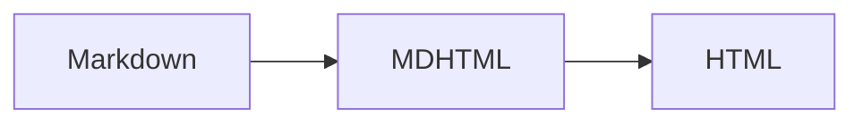

# mdhtml feature sample

This page is the DRY source of the feature tour: each section gives the Markdown source
for one feature, fenced as `markdown`. `mdhtml.tools.sample_md()` expands every such fence
by copying its body in unfenced immediately below, so the tour shows each feature's source
and its rendering without either being written twice. The expanded document is checked in
as `examples/sample-render.md`, and rendered as `docs/sample.html`. The document opens
with a `key: value` frontmatter block, which `viewmd` strips from the content, shows as a
metadata table, and uses for the page title.

## Headings, paragraphs, and inline formatting

`````markdown
### Project notes {#project-notes .section-title}

This paragraph uses *emphasis*, **strong emphasis**, `inline code`,
~~deleted text~~, ==highlighted text==, E=mc^2^, and H~2~O.
`````

### Project notes {#project-notes .section-title}

This paragraph uses *emphasis*, **strong emphasis**, `inline code`,
~~deleted text~~, ==highlighted text==, E=mc^2^, and H~2~O.

All six heading levels are available; deeper levels suit finely nested material:

`````markdown
#### Milestones

##### Third quarter

###### Week one
`````

#### Milestones

##### Third quarter

###### Week one

## Links, images, and autolinks

`````markdown
[fast.ai](https://www.fast.ai/){.external rel="nofollow"} is a normal link
with attributes.

Bare links such as https://example.org/docs are linked automatically.
Angle links work too: <https://example.com/spec>.

{.thumbnail width="96" height="48"}
`````

[fast.ai](https://www.fast.ai/){.external rel="nofollow"} is a normal link
with attributes.

Bare links such as https://example.org/docs are linked automatically.
Angle links work too: <https://example.com/spec>.

{.thumbnail width="96" height="48"}

## Lists and tasks

`````markdown
- Write the outline
- Check the examples
  - Keep them short
  - Keep them readable

1. Parse the Markdown
2. Render MDHTML
3. Add a stylesheet

- [x] Tables
- [x] Footnotes
- [ ] Final polish
`````

- Write the outline
- Check the examples
  - Keep them short
  - Keep them readable

1. Parse the Markdown
2. Render MDHTML
3. Add a stylesheet

- [x] Tables
- [x] Footnotes
- [ ] Final polish

## Block quotes and rules

`````markdown
> A block quote can contain normal inline Markdown.
>
> - It can also contain lists.
> - This is useful for callouts and quoted notes.

`````

> A block quote can contain normal inline Markdown.
>
> - It can also contain lists.
> - This is useful for callouts and quoted notes.

## Tables

`````markdown
| Feature | Status | Notes |
|:--------|:------:|------:|
| Tables | ready | aligned columns |
| Math | ready | brackets mode |
| HTML | ready | raw or markdown-enabled |
`````

| Feature | Status | Notes |
|:--------|:------:|------:|
| Tables | ready | aligned columns |
| Math | ready | brackets mode |
| HTML | ready | raw or markdown-enabled |

Complex tables — row and column spans, block content, a `colwidths` attribute with fixed and fractional tracks — are written as raw HTML table soup:

`````markdown
<table colwidths="1.2in 1fr 2fr">
<tr><th>Property</th><th></th><th>Earth</th></tr>
<tr><td rowspan="2">Temperature 1961-1990</td><td>min</td><td>-89.2 °C</td></tr>
<tr><td>mean</td><td>14 °C</td></tr>
</table>
`````

<table colwidths="1.2in 1fr 2fr">
<tr><th>Property</th><th></th><th>Earth</th></tr>
<tr><td rowspan="2">Temperature 1961-1990</td><td>min</td><td>-89.2 °C</td></tr>
<tr><td>mean</td><td>14 °C</td></tr>
</table>

## Code

`````markdown
Inline code uses backticks, as in `Options::default()`.

``` rust {#example-code .numberLines startFrom="10"}
fn main() {
    println!("hello from mdhtml");
}
```

    let indented_code = true;
`````

Inline code uses backticks, as in `Options::default()`.

``` rust {#example-code .numberLines startFrom="10"}
fn main() {
    println!("hello from mdhtml");
}
```

    let indented_code = true;

## Mermaid diagrams

A `mermaid` code fence is an ordinary code block to the dialect; `md2html` and `viewmd`
emit it as a `<pre class="mermaid">` carrier and load mermaid.js to draw it in place:

`````markdown

`````


## Math in brackets mode

`````markdown
Inline math uses TeX parentheses: \(a^2 + b^2 = c^2\).

Display math can use TeX brackets or double dollars:

\[
\int_0^1 x^2\,dx = \frac{1}{3}
\]

$$
E = mc^2
$$
`````

Inline math uses TeX parentheses: \(a^2 + b^2 = c^2\).

Display math can use TeX brackets or double dollars:

\[
\int_0^1 x^2\,dx = \frac{1}{3}
\]

$$
E = mc^2
$$

## Attributes and spans

`````markdown
This paragraph gets attributes from the following block IAL.
{: #important-note .lead data-kind="sample"}

Bracketed spans work too: [small but important]{.small .important}.
Code spans can have attributes: `render()`{.api-call}.
`````

This paragraph gets attributes from the following block IAL.
{: #important-note .lead data-kind="sample"}

Bracketed spans work too: [small but important]{.small .important}.
Code spans can have attributes: `render()`{.api-call}.

## Definition lists

`````markdown
mdhtml
: A Markdown parser that renders MDHTML fragments.

brackets math
: Math mode that recognizes `\(...\)`, `\[...\]`, and `$$...$$`.

on math
: Math mode that preserves TeX delimiters for client-side renderers.

fenced div
: A Pandoc-style block container opened with colons.
`````

mdhtml
: A Markdown parser that renders MDHTML fragments.

brackets math
: Math mode that recognizes `\(...\)`, `\[...\]`, and `$$...$$`.

on math
: Math mode that preserves TeX delimiters for client-side renderers.

fenced div
: A Pandoc-style block container opened with colons.

## Footnotes

`````markdown
A short note can point to a footnote.[^sample-note]

[^sample-note]: Footnotes can contain *inline Markdown* and links such as
    <https://example.org/>.
`````

A short note can point to a footnote.[^sample-note]

[^sample-note]: Footnotes can contain *inline Markdown* and links such as
    <https://example.org/>.

## Abbreviations

`````markdown
The <abbr title="HyperText Markup Language, version 5">HTML5</abbr> standard changed the web.
`````

The <abbr title="HyperText Markup Language, version 5">HTML5</abbr> standard changed the web.

## Fenced divs

`````markdown
::: {#tip-box .callout .tip kind="tip"}
### A fenced div

Fenced divs are useful for notes, cards, columns, and other styled sections.
They can contain normal **Markdown**.
:::
`````

::: {#tip-box .callout .tip kind="tip"}
### A fenced div

Fenced divs are useful for notes, cards, columns, and other styled sections.
They can contain normal **Markdown**.
:::

## Raw HTML

`````markdown
<section class="raw-panel">
<h3>Raw HTML section</h3>

<p>Raw HTML can stay open across blank lines until its matching close tag.</p>
</section>
`````

<section class="raw-panel">
<h3>Raw HTML section</h3>

<p>Raw HTML can stay open across blank lines until its matching close tag.</p>
</section>

## The HTML subset

Raw HTML is a defined subset: the elements Markdown itself can produce, the
conventional phrasing tags like `<u>` and `<kbd>`, and custom elements.
Anything else — scripts, styles, frames, and the rest — renders as visible
text instead of being parsed, so pasted markup can never restyle the page or
swallow the document:

`````markdown
Literal, not markup: <blink>old tags</blink> and <script>alert(1)</script>.

Accepted: <u>underline</u>, <kbd>Ctrl</kbd>, and
<custom-card kind="note">custom elements</custom-card>.
`````

Literal, not markup: <blink>old tags</blink> and <script>alert(1)</script>.

Accepted: <u>underline</u>, <kbd>Ctrl</kbd>, and
<custom-card kind="note">custom elements</custom-card>.

For full-fidelity HTML anywhere, use a raw block: a fenced code block whose
info string is `{=html}` passes its body through untouched (and inline,
`` `<wbr>`{=html} ``):

`````markdown
```{=html}
<details><summary>Raw HTML block</summary>Any markup at all.</details>
```
`````

```{=html}
<details><summary>Raw HTML block</summary>Any markup at all.</details>
```

## Captions and figures

A paragraph that is exactly one image becomes a figure when `implicit_figures=True`,
with the alt text as its caption. A `: caption` line glued directly under a table captions the table, and
its trailing attribute list applies to the table:

`````markdown
{#fig-diagram width="180"}

| Stage | Days |
|:------|-----:|
| Ship  | 3    |
| Clear | 5    |
: Delivery stages {#tbl-stages}
`````

{#fig-diagram width="180"}

| Stage | Days |
|:------|-----:|
| Ship  | 3    |
| Clear | 5    |
: Delivery stages {#tbl-stages}

## Cross-references

Bracketed `@` references point at ids and render per backend (the docx exporter
makes live REF fields). Sections here get ids automatically from their text:

`````markdown
### Payment terms {#sec-payment}

#### Late fees {#sec-late}

Interest accrues per [@sec-late], within [-@sec-payment], as set out in
[Clause @sec-late]. The terms in [@sec-payment; @sec-late] survive termination.
See also [@fig-diagram] and [-@tbl-stages], or the mixed pair
[@fig-diagram; @tbl-stages]. Variants: the [-@sec-late]{ref=text} clause, on
page [-@sec-late]{ref=page}, paragraph [-@sec-late]{ref=leaf} of
[-@sec-late]{ref=rel}.
`````

### Payment terms {#sec-payment}

#### Late fees {#sec-late}

Interest accrues per [@sec-late], within [-@sec-payment], as set out in
[Clause @sec-late]. The terms in [@sec-payment; @sec-late] survive termination.
See also [@fig-diagram] and [-@tbl-stages], or the mixed pair
[@fig-diagram; @tbl-stages]. Variants: the [-@sec-late]{ref=text} clause, on
page [-@sec-late]{ref=page}, paragraph [-@sec-late]{ref=leaf} of
[-@sec-late]{ref=rel}.

## Raw passthrough

A fenced block whose info string is `{=name}`, or inline code followed by
`{=name}`, passes through for the converter that understands that format;
everyone else drops it:

`````markdown
```{=docx}
<w:p><w:r><w:br w:type="page"/></w:r></w:p>
```
`````

```{=docx}
<w:p><w:r><w:br w:type="page"/></w:r></w:p>
```
## Inline footnotes

An inline footnote needs no separate definition:

`````markdown
A quick aside.^[Inline footnotes hold arbitrary *inline* Markdown.]
`````

A quick aside.^[Inline footnotes hold arbitrary *inline* Markdown.]

## Template tokens and filling

Mustache-spelled tokens are recognized when a `templates=` configuration is passed
(`viewmd` and `md2html` pass one by default) and render as inert pills, so a template
previews without running. `fillmd` fills them, gathering defaults from the document's
own `formdata:` frontmatter — this page's frontmatter supplies every field below, so
`fillmd examples/sample-clean.md` (the generated plain register, where the example is
live rather than fenced) completes this section. A var substitutes text in place;
a range's behavior is decided by its value's *type*: falsy drops it, a dict keeps it
once as a scope, a list repeats it per item, and `{{^` keeps only on falsy:

`````markdown
Prepared for {{client}}.

{{#office}}
The {{name}} office ({{city}}) handles this matter.
{{/office}}

| Item | Qty |
|------|-----|
{{#items}}
| {{name}} | {{qty}} |
{{/items}}

{{^rush}}
Standard processing applies.
{{/rush}}
`````

Prepared for {{client}}.

{{#office}}
The {{name}} office ({{city}}) handles this matter.
{{/office}}

| Item | Qty |
|------|-----|
{{#items}}
| {{name}} | {{qty}} |
{{/items}}

{{^rush}}
Standard processing applies.
{{/rush}}
